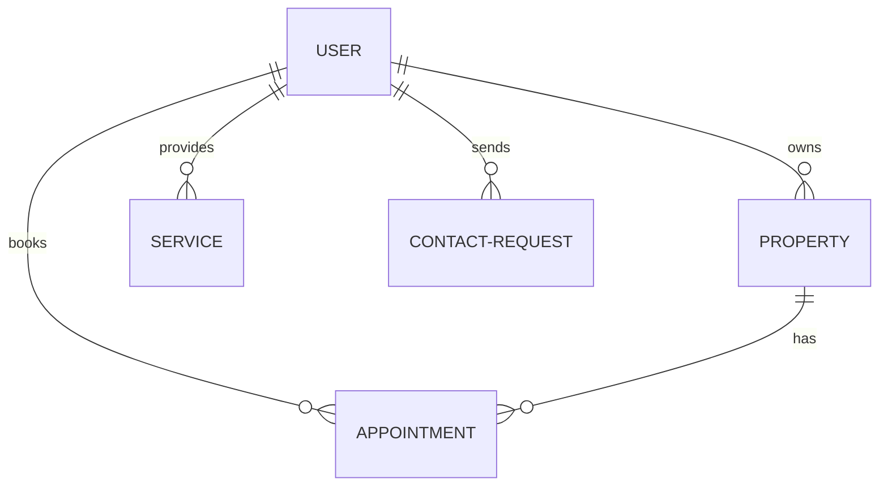

# ApniEstate Database Design

ApniEstate uses MongoDB with Mongoose for a flexible, document-oriented data model.

## 📊 Data Schema Overview

The system is centered around three primary entities: **Users**, **Properties**, and **Services**.

### 👤 Users Collection
Stores account information, roles, and preferences.
- **Roles**: `user` (default), `vendor`, `admin`.
- **References**: `savedProperties` (refs Property).

### 🏠 Properties Collection
Comprehensive data for real estate listings.
- **Fields**: title, description, price, type (villa, apartment, etc.), category (rent, buy, sell).
- **Location**: Structured as a sub-document with coordinates.
- **Images**: Array of objects with ImageKit `fileId` and `url`.
- **Relations**: Linked to `owner` (ref User).

### 🛠 Services Collection
Professional service offerings from vendors.
- **Fields**: title, description, categories (plumber, painter, vastu, etc.).
- **Prices**: Min/Max range for flexible quotes.
- **Relations**: Linked to `vendor` (ref User).

### 📅 Appointments Collection
Interactions between users and property listings.
- **Fields**: dateTime, status (pending, confirmed, cancelled).
- **Relations**: Linked to both `User` and `Property`.

## ⚡ Performance Optimization

- **Indexing**: 
  - `email`: Unique index for fast lookups.
  - `location.city`: For location-based searches.
  - `price`: For sorted listings.
  - `status`: For filtering approved properties.
- **Virtuals**: Used for formatted strings (e.g., `formattedPrice`) and aggregated data.

## 📁 Storage Strategy
- **File Assets**: Images are NOT stored in MongoDB; only their persistent metadata and ImageKit URLs are indexed.
